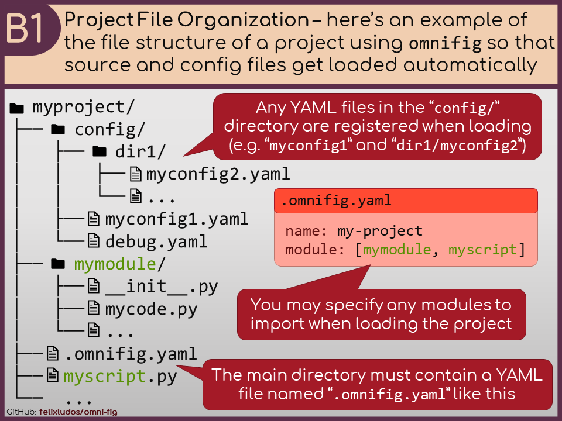
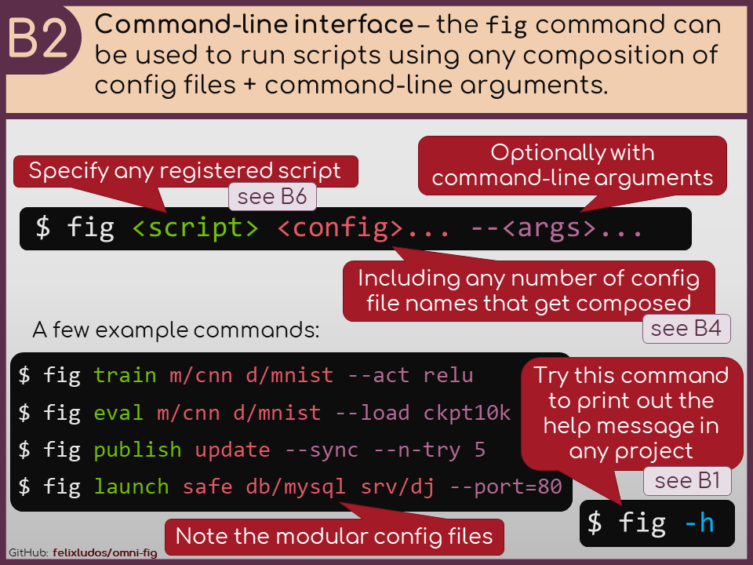
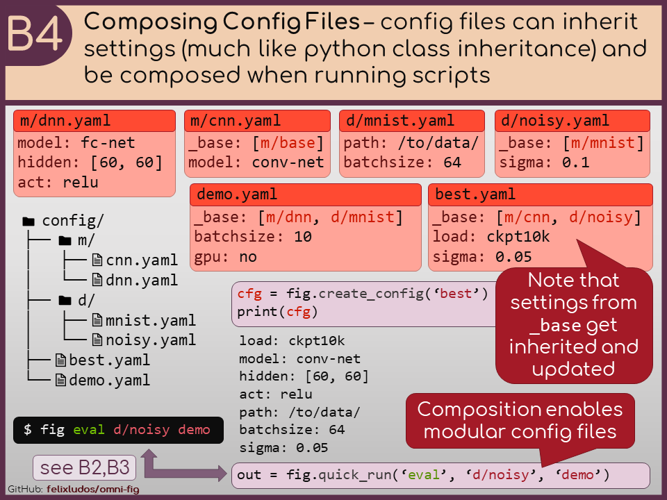
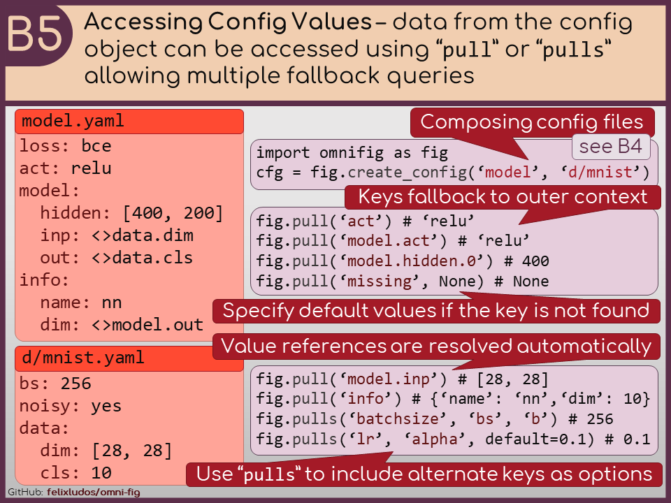
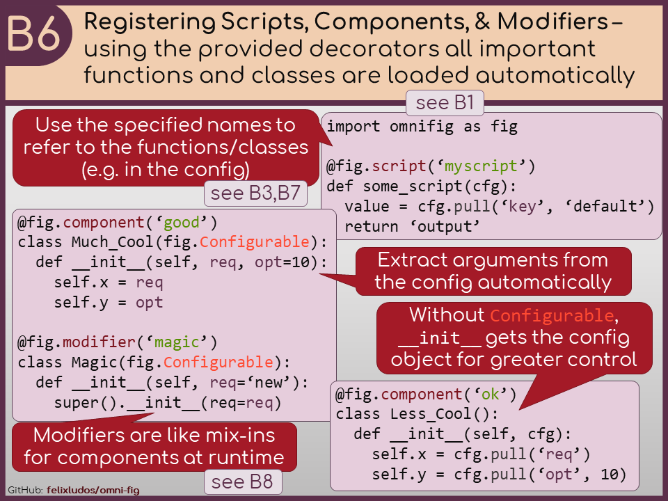
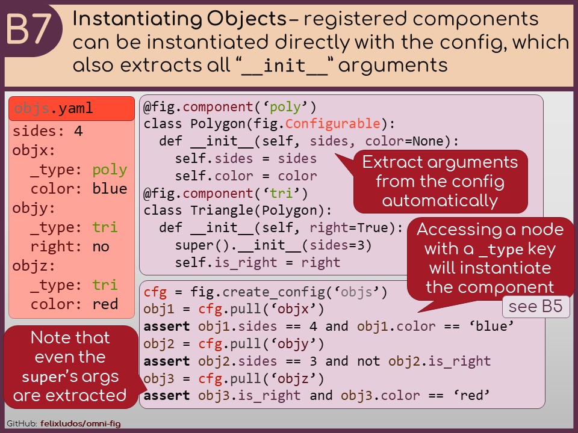
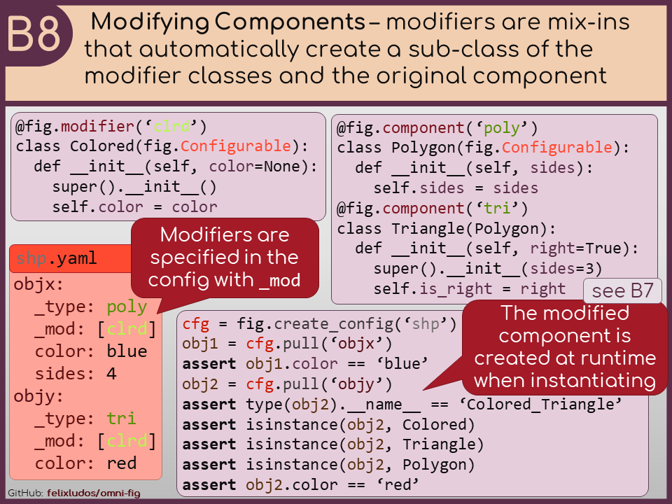

.. role:: py(code)
   :language: python

.. raw:: html

    

========
omni-fig
========
+++++++++++++++++++++++++++++++++++++++++++++++++++++++++++++
Unleashing Project Configuration and Organization in Python
+++++++++++++++++++++++++++++++++++++++++++++++++++++++++++++

.. image:: https://readthedocs.org/projects/omnifig/badge/?version=latest
    :target: https://omnifig.readthedocs.io/en/latest/?badge=latest
    :alt: Documentation Status

.. image:: https://github.com/felixludos/omni-fig/actions/workflows/tests.yaml/badge.svg
    :target: https://github.com/felixludos/omni-fig/actions/workflows/tests.yaml
    :alt: Unit-Tests

.. setup-marker-do-not-remove

.. role:: py(code)
   :language: python

.. Visit the project page_.
  .. _page: https://www.notion.so/felixleeb/omni-fig-c5223f0ca9e54eb4b8d9749aade4a9d3

.. TODO: lightweight, general purpose configuration system

|

``omni-fig`` is a lightweight package to help you organize your python projects to make everything clear and easy to understand to collaborators and prospective users, while also offering unparalleled features to accelerate development.

The proposed general-purpose project structure is well suited for both small and large projects, and is designed to be easily extensible to fit your needs. Most importantly, with the powerful configuration system, you never have to worry about any boilerplate code to parse command line arguments, read config files, or even import the top-level project components ever again!

.. The primary way to use this package is to create *projects* containing python source files and yaml (info and config) files (an example of which is discussed below). Each project uses ``component``, ``modifier``, and ``script`` to register artifacts which can then be referenced in the config.

For lots of examples in how the config system works check out the documentation_ or ``examples/``.

.. _documentation: https://omnifig.readthedocs.io/

.. _highlights: https://omnifig.readthedocs.io/en/latest/highlights.html

Install
-------

.. install-marker-do-not-remove

Everything is tested with Python 3.7 on Ubuntu 20.04 and Windows 11, but in principle it should work on any system that can handle the dependencies.

The easiest way to install the stable release is with pip:

.. code-block:: bash

    pip install omnifig

If you want to explore the examples or contribute to the project, you can install the latest version by cloning the repository and installing it with pip:
If you want to explore the examples or want to contribute to the project, you can clone the repository and install the package in development mode:

.. code-block:: bash

    git clone https://github.com/felixludos/omni-fig
    pip install -e ./omni-fig

.. end-install-marker-do-not-remove

Key Features
------------

.. highlights-marker-do-not-remove

.. Check out an overview of some of the core features of ``omni-fig``: `highlights`_.

Here is an overview of some of the core features of ``omni-fig`` with links to more detailed guides.

.. image:: docs/_static/img/vignettes/Slide3.PNG
    :width: 100%
    :target: https://omnifig.readthedocs.io/en/latest/project-structure/interactive.html#highlight-interactive

.. end-highlights-marker-do-not-remove

Citation
--------

.. citation-marker-do-not-remove

If you used ``omni-fig`` in your work, please cite it using:

.. code-block:: tex

   @misc{leeb2022omnifig,
     title = {Omni-fig: Unleashing Project Configuration and Organization in Python},
     author = {Leeb, Felix},
     publisher = {GitHub},
     year = {2022}
   }

.. end-citation-marker-do-not-remove

Contributions
-------------

Feedback and contributions are very welcome! Please feel free to open an issue or pull request.

Thank you to Amanda Leeb for designing the logo!

.. Here's a list of features and extensions in the works:

.. Road to 1.0
	===========

	Major features to be added in the near future:

	- configuration macros for modifying every part of the config behavior
	- customized the print messages or logging when using a config
	- enable multi-processing with registered artifacts
	- server run mode to submit, monitor, and schedule commands
	- full coverage with unit tests
	- clean up global settings and env variables

	Feedback and contributions are always welcome.

.. end-setup-marker-do-not-remove