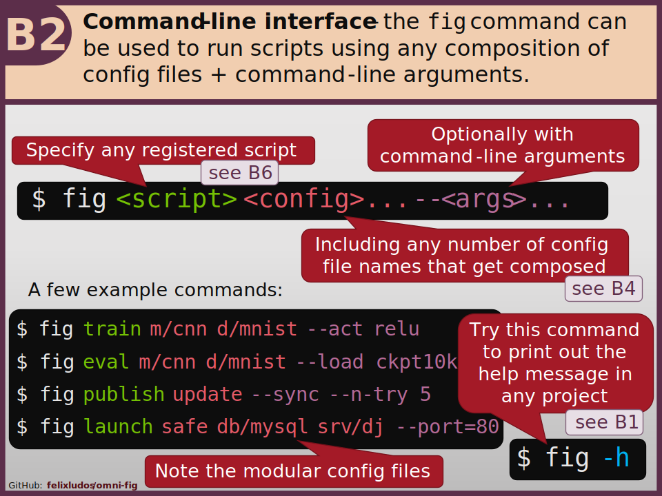
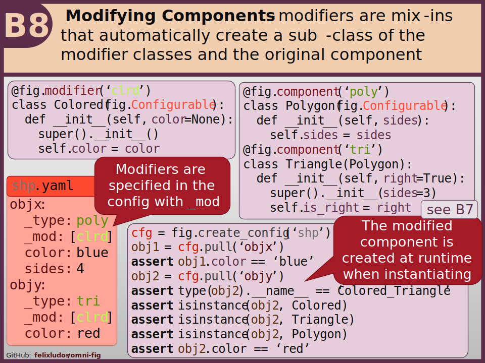

Key Features
====================

.. .. include:: ../README.rst
    :start-after: highlights-marker-do-not-remove
    :end-before: end-highlights-marker-do-not-remove

Here is an overview of some of the core features of ``omni-fig`` with links to more detailed guides.

.. image:: _static/img/vignettes/Slide1.SVG
    :width: 100%

Check out the :ref:`file structure <highlight-file-structure>` of projects.

Read more about the :ref:`command line interface <highlight-cli>`.

.. image:: _static/img/vignettes/Slide3.SVG
    :width: 100%

Learn more about using ``omni-fig`` in :ref:`interactive programming environments <highlight-interactive>`.

Learn more about :ref:`composing configuration files <highlight-config-composition>`.

.. image:: _static/img/vignettes/Slide5.SVG
    :width: 100%

Read more about how to :ref:`access config values <highlight-config-access>`.

Check out the guide for details on :ref:`project components <highlight-registration>`.

.. image:: _static/img/vignettes/Slide7.SVG
    :width: 100%

See the power of automatically :ref:`instantiating objects <highlight-instantiation>` from the config.

Learn more about :ref:`modifying components <highlight-modifiers>`.

