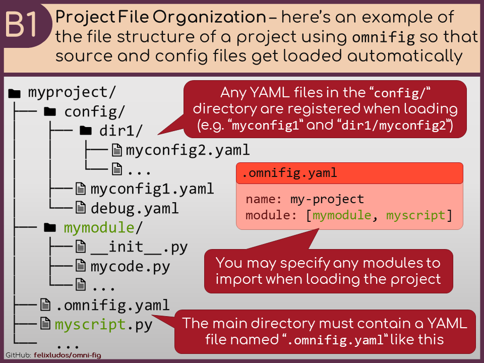
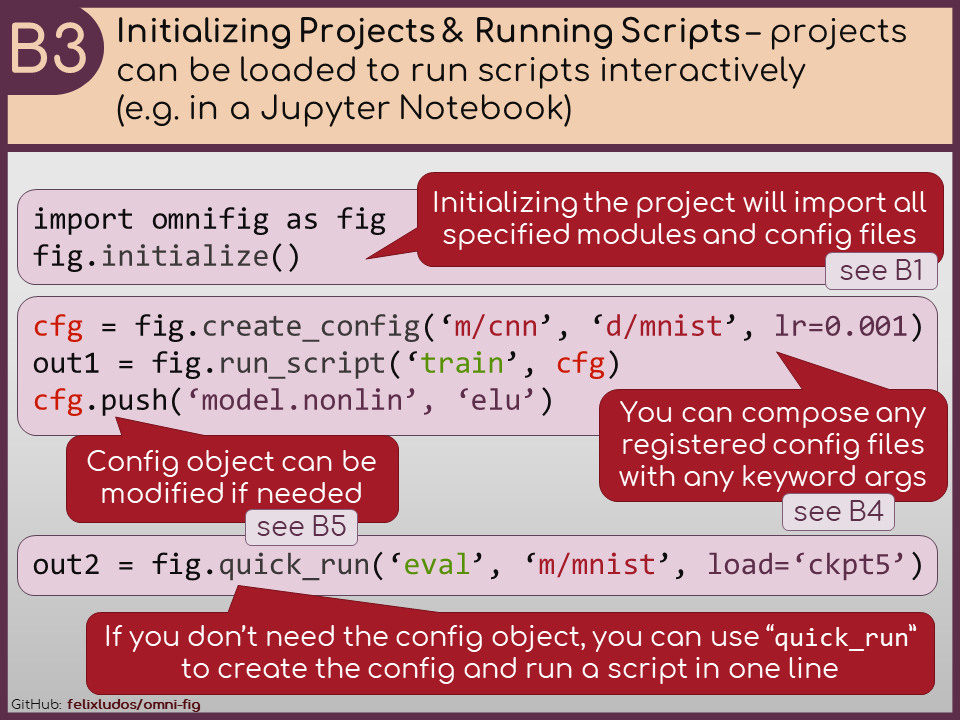
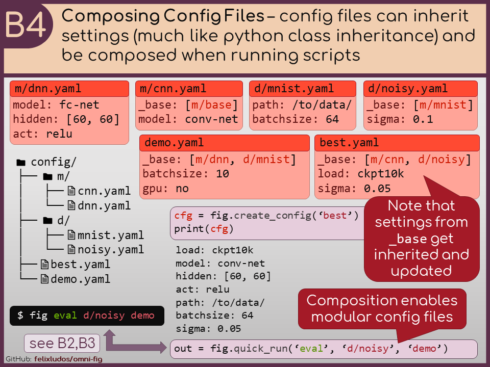
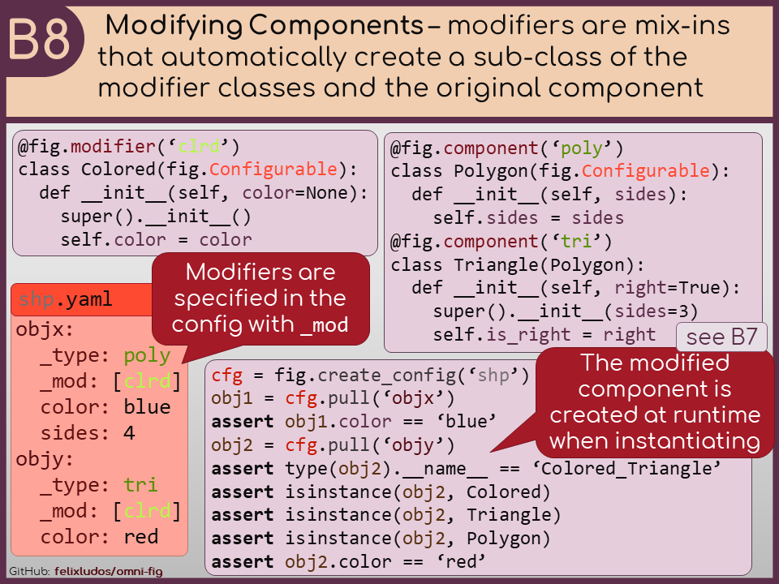

Key Features
====================

.. .. include:: ../README.rst
    :start-after: highlights-marker-do-not-remove
    :end-before: end-highlights-marker-do-not-remove

Here is an overview of some of the core features of ``omni-fig`` with links to more detailed guides.

.. _vignette-file-structure:

Check out the :ref:`file structure <highlight-file-structure>` of projects.

.. _vignette-cli:

.. image:: _static/img/vignettes/Slide2.PNG
   :width: 100%

Read more about the :ref:`command line interface <highlight-cli>`.

.. _vignette-interactive:

Learn more about using ``omni-fig`` in :ref:`interactive programming environments <highlight-interactive>`.

.. _vignette-composition:

Learn more about :ref:`composing configuration files <highlight-config-composition>`.

.. _vignette-config-access:

.. image:: _static/img/vignettes/Slide5.PNG
    :width: 100%

Read more about how to :ref:`access config values <highlight-config-access>`.

.. _vignette-registration:

.. image:: _static/img/vignettes/Slide6.PNG
   :width: 100%

Check out the guide for details on :ref:`project components <highlight-registration>`.

.. _vignette-instantiation:

See the power of automatically :ref:`instantiating objects <highlight-instantiation>` from the config.

.. _vignette-modifiers:

Learn more about :ref:`modifying components <highlight-modifiers>`.

